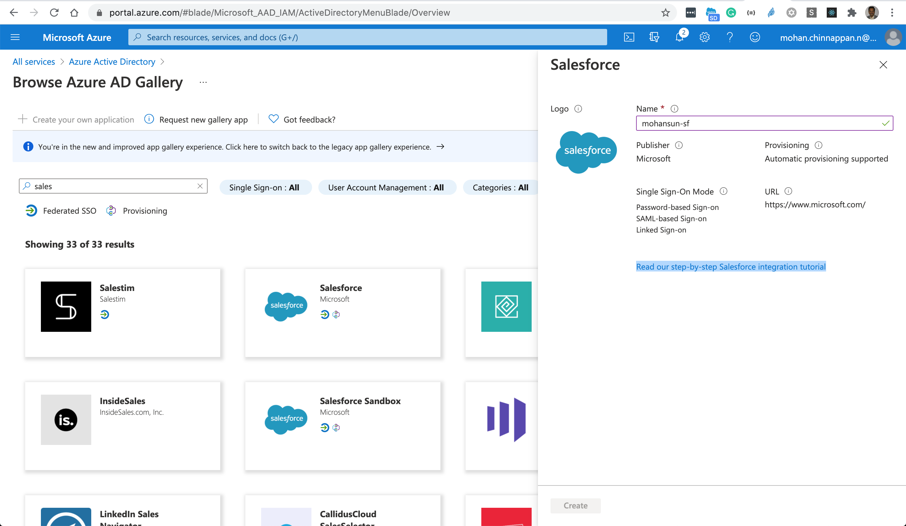
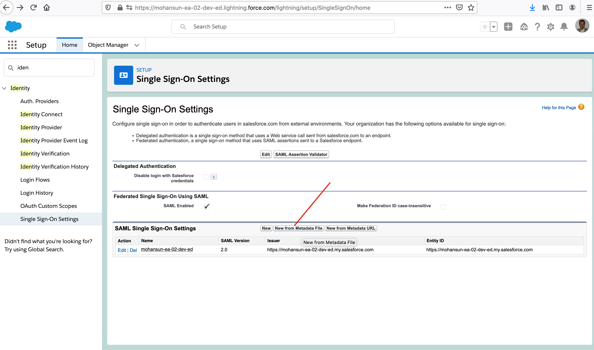

# Setting up Salesforce SSO with Azure Active Directory

## Topics
- [Azure AD setup](#adsetup)
- [Salesforce setup](#sfsetup)
-  [Resources](#resources)

## Azure AD Setup

### SSO Modes
- An application listed in the Azure AD gallery may support one (1) or more sign-on types:
    - SAML/OpenID Connect based single sign-on allow users to use their organizational accounts to access applications.
    - Password-based single sign-on enables secure application password storage and replay using a web browser extension or mobile app.
    - Linked sign-on enables admins to add a link to a URL to be shown in My Apps. This option is a redirection to the configured URL. It does NOT add single sign-on to the application.

### Provisioning
- Most applications require user accounts and profiles to exist within the application, prior to those users being allowed to sign in. 
    - This account is what enables a user to be authorized to use the app, after they have authenticated through single sign-on. 
    - For selected apps, Azure Active Directory supports the ability to automatically **provision and de-provision** these accounts.

## Salesforce Setup

## Resources 
- [Tutorial: Azure Active Directory single sign-on (SSO) integration with Salesforce](https://docs.microsoft.com/en-us/azure/active-directory/saas-apps/salesforce-tutorial)
- [How to use Google as OpenID Connect provider for Salesforce?](https://github.com/mohan-chinnappan-n/cli-dx/blob/master/oid/openId-connect.md)

